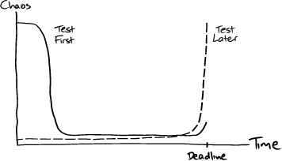

We should be taught not to wait for inspiration to start a thing. Action always generates inspiration. Inspiration seldom generates action.

—Frank Tibolt

Start by automating the build and deployment process. Sounds odd for a nascent system but it's important to do so, because "later" means "never".

The authors have seen projects canceled after months of work since they couldn't reliable deploy the system.

"Feedback is a fundamental tool"

## Walking skeleton

It's difficult to build the first feature while at the same time trying to automate all of these processes. To work around this paradox build the simplest thing possibly that can be automated. For example, with a web application backed by a database you can display a simple web page that retrieves a couple of fields from the database.

They describe acceptance / end-to-end tests as something that will build the app, deploy it, then run the tests in a production-like environment.

Another benefit to automating all of this upfront is that it reveals organizational dependencies. So if it takes several weeks and a few signatures (from managers and operational folks) then that it something you want to know sooner rather than later.

When working on the "walking skeleton" don't worry about writing the best, most expressive test. At this point the value is setting up automation around the system.

For later tests we should "write the test you want to read." (more on page 42).

## Build sources of feedback

"Our ideal situation is where the team releases regularly to a real production system, as in Figure 4.3. This allows the system’s stakeholders to respond to how well the system meets their needs, at the same time allowing us to judge its implementation."

## Expose uncertainty early

You'll be surprised by how long it might take to get even a skeleton to production since it requires coordinating with different individuals and groups.

Note that there is an additional challenge of the team learning the social norms of working together.

Incremental development can be stressful for people since it moves the stress of a project to earlier in the life span. In traditional software approaches this stress is at the end due to all of the teams integrating their work and squashing bugs.

## Brownfield development

Most projects will have an existing application so you won't have to create a walking skeleton. Though you'll have to tackle the challenges of not only technical debt but most likely adding a test suite around it. Michael Feathers wrote a book on this topic called "Working Effectively with Legacy Code".

Best way to start the TDD process for an existing system is to automate the build & deploy process and then to write end-to-end tests to catch regressions.
