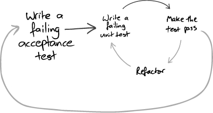

## Start each feature with an acceptance test

They mention that they write acceptance tests using language of the domain, not in technical terms (e.g. databases).

This is at odds from what we typically see with cucumber and capybara, since these tools typically talk about interacting with an user interface.

The goal of this abstraction is to decouple the tests from the underlying tech stack. E.g. a switch from ftp & binary files to web services and XML shouldn't be a problem

> We find that writing such a test before coding makes us clarify what we want to achieve.

Helps you refocus on the user and their perspective.

As for unit tests, they enable you to work with objects in isolation and aid you in the design of the internals of the system.

"Acceptance tests both test the integration of unit-tested objects and push the project forwards."

## Separate tests that measure progress from those that catch regressions

Acceptance tests - relatively-slow, catch regressions, fail until implemented
Unit & integration - relatively-fast, support the development team, should always pass

They mention about placing the acceptance tests that have been implemented in previous stories in a "regression suite", while placing ones that are in-flight in a "in-progress suite".

## Start testing with the simplest success case

Failure cases don't provide as much value and won't give us feedback about our approach to the problem. It also can negatively impact morale.

Fill in the error scenarios once you have the simplest success case implemented.

> We find it useful to keep a notepad or index cards by the keyboard to jot down failure cases, refactorings, and other technical tasks that need to be addressed.

## Story time: Iterations in space

NASA approached the mission of landing a person on the moon in 7 incremental steps.

## Write the test you would want to read

Be clear as possible about the desired behavior, focus on the text and not about what supporting code is already defined. Then write that supporting code until the test fails the way you expected and ensure it's failure message is clear.

## Watch the test fails

Sometimes you'll be surprised in how the test fails and it some cases it might even pass. This is especially important in dynamic, flexible languages like ruby.
Focus on the error messages:
 - validates our assumptions about the code
 - you should focus on making the intentions explicit so that the system is more maintainable

## Develop from the inputs to the outputs

We work from the UI to the internal objects, to the domain and possibly with external components.

It's tempting to start with the domain models and then hook it into the rest of the system but that typically leads to integration challenges.

## Unit test behavior not methods

High test coverage doesn't mean the codebase will be easy to work with. Tests that focus purely on methods can lead to tests that describe what the code does but not what's it's for.

Focus on the features that the subject should support. The tests should describe how to leverage the class for a use case. Focusing on code coverage is an anti-goal.

Story time: - Nat revisited a project that focused on testing individual methods and realized that the code was hard to understand. It wasn't clear how each object was supposed to behave, what the responsibilities were, and how the different methods of objects work together.

## Listen to the tests

If a test is difficult to write then that typically means the design of the object under test should be improved.

> It's time to bust out the refactor tractor

The alternative way to response is to leave the design as is, which will eventually lead to "software rot".

## Tuning the cycle

Need a balance of the granularity of the tests. Too coarse and the number of permutations will cause the test suite to explode in execution time.

Too fine grain will cause problems when you attempt to integrate objects.
